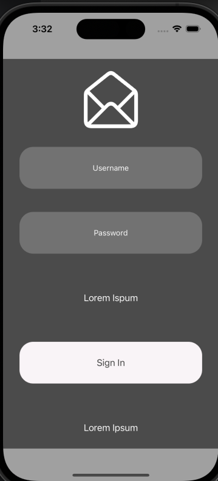

# Neobis_IOS_LoginApp

This Project is a simple LogIn application written in Swift 
It allows to see entered Username and Password in the terminal
Nicely designed with UI elements

1. layout: UI StoryBoard
2. Login and password: UITextField
3. Sign-in button: UIButton
4. UIlabels

    
Resizable
    

  

